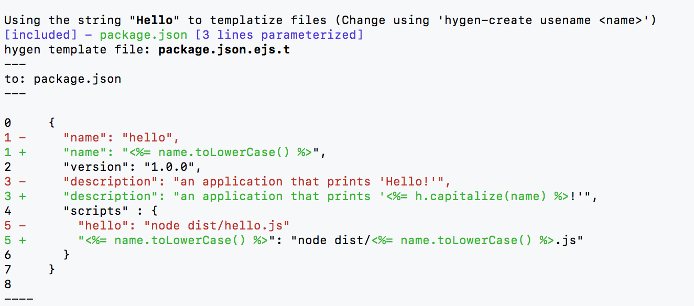

[](https://travis-ci.org/ronp001/hygen-create)

# hygen-create
Simplifies creation of [hygen](http://www.hygen.io) templates from existing projects


## Why

Because creating templates from existing projects is annoying

## In a nutshell

`hygen-create` takes a set of existing project files and uses them to create
`hygen` template files, replacing a selected word with appropriate placeholders (such as <%= name.toLowerCase() %>, <%= h.inflection.camelize(name, true) %>, etc) entries.

The resulting template files can be used as is (using the `hygen <generator> new` command - assuming [hygen](http://www.hygen.io) is installed), or they can be manually edited and changed as desired.


## Installation

```
$ yarn global add hygen-create
```

or

```
$ npm install -g hygen-create
```

Note that this does NOT install `hygen`. To use the generators made by hygen-create you must have [hygen](http://www.hygen.io) installed as well.

## Generating a generator

There are several steps to generating a generator:

1. Start a hygen-create session: `hygen-create start <generator-name>`
1. `hygen-create add <file> ...` to select files to be templatized for the generator.
1. `hygen-create usename <name>` to indicate which word to replace with placeholders (of the <%= name %> family):  (Note: it's currently highly recommended to use a CamelCased value - see [limitations](#limitations))
1. (Optionally) `hygen-create status` to view information about replacements to be made
1. (Optionally) [configure](#Configuration:-setting-target-_templates-directory) the target ```hygen``` _templates directory
1. `hygen-create generate` to generate the new generator

The result:  a new ```hygen``` generator will be created.  You can now use ```hygen <generator-name> new --name <target-name>``` to use your new generator.

## Example session

Just to give a sense of how `hygen-create` works, let's suppose we have a small project that we'd like to reuse as a starting point for other projects.

Our directory hierarchy is:

```
/projects/hello
 |-package.json
 |-dist
    |-hello.js
```

The contents of `package.json`:

```json
{
  "name": "hello",
  "version": "1.0.0",
  "description": "an application that prints hello",
  "scripts" : {
    "hello": "node dist/hello.js"
  }
}
```

The contents of `dist/hello.js`:

```js
// This is hello.js
console.log("Hello!")
```

Although quite simple (and frankly, useless), this is a fully-functioning package 
and we can run the `hello` script by typing `npm run hello`:

```bash
$ npm run hello

> hello@1.0.0 hello /example
> node dist/hello.js

Hello!
```

### creating a generator

Let's now use `hygen-create` to generate a `greeter generator` from this project.

We'll first start a `hygen-create` session:
```
$ hygen-create start greeter
created hygen-create.json
```

Now let's add our files:

```
$ hygen-create add package.json dist/hello.js 
adding:  package.json
adding:  dist/hello.js
```

If we take a look at `hygen-create.json`, we'll see the added files are listed there:

```
$ cat hygen-create.json 
{
  "about": "This is a hygen-create definitions file. The hygen-create utility creates generators that can be executed using hygen.",
  "hygen_create_version": "0.2.0",
  "name": "greeter",
  "files_and_dirs": {
    "hygen-create.json": true,
    "package.json": true,
    "dist/hello.js": true
  },
  "templatize_using_name": null,
  "gen_parent_dir": false
}
```

You might notice that `hygen-create` automatically added `hygen-create.json` even though
we did not add it explicitly.  The addition of `hygen-create.json` to the generator
makes it easy to iteratively improve the generator we're creating, as we'll see later on.

Now let's tell `hygen-create` that it should turn the word `Hello` into the `name` parameter
of the generator:

```
$ hygen-create usename Hello
using 'Hello' as templatization word
6 matching lines found in 3 included files
```

We can check the status of the session by typing `hygen-create status`:
```
$ hygen-create status 

Using the string "Hello" to templatize files (Change using 'hygen-create usename <name>')

The following files are included in the generator:
[included] - hygen-create.json [2 lines parameterized]
[included] - package.json [3 lines parameterized]
[included] - dist/hello.js [2 lines parameterized]

No target dir: HYGEN_CREATE_TMPLS not set, HYGEN_TMPLS not set, local dir (./_templates) does not exist

Parent dir generation: OFF (the resulting generator will add content to the current directory)
```

If we'd like to see how our files will be templatized, we can use `hygen-create status -v <file>` to check that out.

So typing ```$ hygen-create status -v package.json``` will output:


This shows us what the resulting template file will look like (in [hygen template format](http://www.hygen.io/templates)), including a diff of the lines that undergo parameterization.

You might notice that on line 1, ```hello``` is replaced with ```<%= name.toLowerCase() %>```, while on line 3, ```Hello``` 
is replaced with ```<%= h.capitalize(name) %>```.  


Before we generate the generator, we need to ```export HYGEN_CREATE_TMPLS``` to set the target directory.
For the sake of our example, let's ```export HYGEN_CREATE_TMPLS=/tmp/_templates```.

Our final step is to generate the new `greeter` generator:
```
$ hygen-create generate
target path:  /tmp/_templates
generating: /tmp/_templates/greeter/new/hygen-create.json.ejs.t
generating: /tmp/_templates/greeter/new/package.json.ejs.t
generating: /tmp/_templates/greeter/new/dist_hello.js.ejs.t
```

### using the generator

We now have a `hygen` generator called `greeter` that is ready to use. For example, we can run:
```
$ export HYGEN_TMPLS=/tmp/_templates 
$ mkdir /tmp/dev/hola-greeter
$ cd /tmp/dev/hola-greeter
$ hygen greeter new --name Hola

Loaded templates: /tmp/_templates
       added: dist/hola.js
       added: hygen-create.json
       added: package.json
```

This will generate a new app for us, this one printing `Hola!` instead of `Hello!`:

```
$ cd hola-greeter
$ npm run hola

> hola@1.0.0 hola /private/tmp/dev/hola-greeter
> node dist/hola.js

Hola!
```

The reason this prints Hola! and not Hello! is that dist/hola.js now contains the
updated code:
```
$ cat dist/hola.js 
// This is hola.js
console.log("Hola!")
```

You may have noticed that to run this we used `npm run hola` rather than `npm run hello`. 
This is because `package.json` created by the `greeter generator` looks like this:

```json
{
  "name": "hola",
  "version": "1.0.0",
  "description": "an application that prints 'Hola!'",
  "scripts" : {
    "hola": "node dist/hola.js"
  }
}
```

### iteratively improving the generator

As you may remember, `hygen-create` automatically included `hygen-create.json` as part of the 
generator.  As a result, when we used the generator to create the `hola` app, we automatically
got a copy of `hygen-create.json` in our directory:

```
$ ls
dist/  hygen-create.json  package.json
```

So if we run `hygen-create status` here, we'll see that the generated files are already
included, and the `hygen-create usename <string>` value and generator name are already set:

```
$ hygen-create status

Using the string "Hola" to templatize files (Change using 'hygen-create usename <name>')

The following files are included in the generator:
[included] - hygen-create.json [2 lines parameterized]
[included] - package.json [3 lines parameterized]
[included] - dist/hola.js [2 lines parameterized]

Target dir: /tmp/_templates/greeter

Parent dir generation: OFF (the resulting generator will add content to the current directory)
```

This way we can make changes to the generated project and immediately turn those into an updated
version of the generator.  For example, let's make a slight modification to `dist/hola.js`:

```
$ cat dist/hola.js 
// This is the improved hola.js
console.log("Hola! Hola!")
```

Test our changes:
```
$ npm run hola

> hola@1.0.0 hola /private/tmp/dev/hola-greeter
> node dist/hola.js

Hola! Hola!
```

And run `hygen-create` again - although we'll want to change the name of the created generator by running:
```
$ hygen-create rename greeter2
```

Now we can run:
```
$ hygen-create generate
target path:  /tmp/_templates
generating: /tmp/_templates/greeter2/new/hygen-create.json.ejs.t
generating: /tmp/_templates/greeter2/new/package.json.ejs.t
generating: /tmp/_templates/greeter2/new/dist_hola.js.ejs.t
```

And if we examine `/tmp/_templates/greeter2/new/dist_hola.js.ejs.t` we'll see that the changes we made
to the project have been reflected in the new `greeter2` generator:

```
$ cat /tmp/_templates/greeter2/new/dist_hola.js.ejs.t
---
to: dist/<%= name.toLowerCase() %>.js
---
// This is the improved <%= name.toLowerCase() %>.js
console.log("<%= h.capitalize(name) %>! <%= h.capitalize(name) %>!")
```

## Previous versions of generators

When the `hygen generate` command executes, it checks if the generator directory already exists.
If it does, and the newly created generator is different from the existing one, it will keep the existing generator but rename it by adding a version suffix.

For example, the first time the command to create a generator called `mygen` is executed, the directory
`<templates-path>/mygen/new` will be created.  The next time this command is run, `<templates-path>/mygen/new` will be renamed to `<templates-path>/mygen/new.1`, and a new `<templates-path>/mygen/new` will be created. 
If the command is run again, `<templates-path>/mygen/new` will be renamed to `<templates-path>/mygen.2`, and so forth.

Note that a new version will not be created if the generator is identical to the previous one.

## Configuration and options

### Configuration: setting target _templates directory

`hygen-create` will look for a `hygen` _templates directory in the following order:
1. env var `HYGEN_CREATE_TMPLS` if set and points to an existing directory
1. env var `HYGEN__TMPLS` if set and points to an existing directory
1. an existing `_templates` directory in the current dir

`hygen-create` will not create a _templates directory, and will abort with an error if no such directory is found.

### Option: parent directory generation

* Turning on:  `hygen-create setopt --gen-parent-dir`
* Turning off: `hygen-create setopt --no-parent-dir`
* .json file field:  `"gen_parent_dir" (boolean)`
* Default: 
  * If `hygen-create` session was initiated using `hygen-create v0.1.x`: on
  * If `hygen-create` session was initiated using `hygen-create v0.2.0` and up: off


**When turned off**: the resulting generator will create contents in the current directory.

**When turned on**: the resulting generator will create a parent directory for all  contents.  The name of the parent directory will be the value passed in the `--name` option of the generated `hygen` generator.


Example 1: --no-parent-dir
```bash
# start the session
$ hygen-create start mygen

# add a file
$ hygen-create add file1       

# specify name to templatize
$ hygen-create usename xyz

# ensure parent-dir generation is off
$ hygen-create setopt --no-parent-dir

# create the generator
$ hygen-create generate  # this creates the generator _templates/mygen

# run the generator
# The result: the resulting generator will create ./file1 (i.e., in the current directory)
$ hygen mygen new --name hi

Loaded templates: _templates
      added: file1
```

Example 2: --gen-parent-dir
```bash
# start the session
$ hygen-create start mygen

# add a file
$ hygen-create add file1       

# specify name to templatize
$ hygen-create usename xyz

# ensure parent-dir generation is off
$ hygen-create setopt --gen-parent-dir

# create the generator
$ hygen-create generate  # this creates the generator _templates/mygen

# run the generator
# The result: the resulting generator will create the dir './hi' and then create ./hi/file1
$ hygen mygen new --name hi

Loaded templates: _templates
      added: hi/file1

```


## Limitations

### String format (CamelCase, dash-cased, etc.) for the ```hygen-create usename <name>``` command

TL;DR: provide a CamelCased ```usename/--name``` value both to ```hygen-create``` and to ```hygen```

* ```hygen-create``` currently works best if you provide a CamelCased string to the ```usename``` command.  When provided a CamelCased name, ```hygen-create``` 
will recognize dash-cased, underscore_cased "Title Cased" and other versions.  But this recognition currently doesn't work well when the
value provided to ```usename``` not CamelCased.
* There is currently a tight relationship between the format of the ```usename``` string provided to ```hygen-create``` and the string that needs to be provided to ```hygen <generator> new --name <name>```.  This may be changed in the future, but right now you should provide the same 
format to both commands.

## List of availble commands:
```
$ hygen-create 

  Usage: hygen-create [options] [command]

  hygen-create - create hygen templates from an existing project


  Options:

    -V, --version             output the version number
    -v, --verbose             provide more info
    -p, --project <filename>  name of session definitions file (default: hygen-create.json)
    -h, --help                output usage information


  Commands:

    start [options] <generator-name>      initiate a definition session for the generator <generator-name>
    rename <generator-name>               change the name of the target generator to <generator-name>
    add <file|dir> [file|dir...]          add files or directories to be templatized
    remove|rm <file|dir> [file|dir...]    do not templatize specified files/directories
    usename <name>                        set <name> as the templatization param
    setopt [options]                      configure options for the generator
    status|s [options] [file] [files...]  show replacements to be made in (all|specified) files
    generate|g [options]                  generate a generator from the added files
```

---


## Copyright
(C) 2018 Ron Perry. [MIT License](LICENSE.txt).